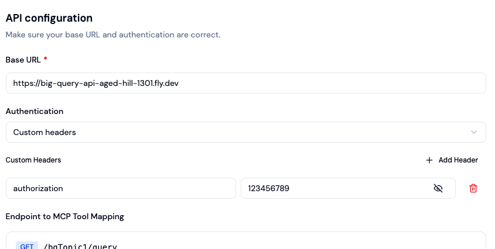

# Big Query API

A Node.js Express API that connects to Google BigQuery.

## Project Structure

```
big-query-api/
├── src/
│   ├── main.ts              # Entry point - Express server setup
│   ├── lib/
│   │   ├── bigquery.ts      # BigQuery client configuration
│   │   └── swagger.ts       # Swagger/OpenAPI configuration
│   └── routes/
│       ├── bqTopic1.ts      # Routes for BigQuery topic 1
│       └── bqTopic2.ts      # Routes for BigQuery topic 2
├── dist/                    # Compiled JavaScript (generated)
├── .env                     # Environment variables (create from template)
├── .env.template            # Environment variables template
├── Dockerfile               # Docker configuration for deployment
├── fly.toml                 # Fly.io deployment config
├── package.json
└── tsconfig.json
```

## Prerequisites

- Node.js 22+
- npm
- Google Cloud account with BigQuery access
- Service account JSON key (for production)

## Getting Started

### 1. Install dependencies

```bash
npm install
```

### 2. Set up environment variables

Copy the template and fill in your values:

```bash
cp .env.template .env
```

Then edit `.env` with your configuration:

```bash
GCP_PROJECT_ID=your-project-id
GCP_LOCATION=europe-west3
GCP_CREDENTIALS_JSON=<your-service-account-json>
```

### 3. Configure Google Cloud authentication

1. Get your service account JSON key file
2. Convert it to a single line:
   ```bash
   cat /path/to/service-account.json | tr -d '\n'
   ```
3. Paste the output as `GCP_CREDENTIALS_JSON` in your `.env` file


If you are directly using the data from supabase, use:
# Extract and compact the service account JSON
cat dlg-key.json | jq -r '.BIGQUERY_KEY_CONTENT' | jq -c .

### 4. Run the development server

```bash
npm run dev
```

The server will start at `http://localhost:3000` and auto-restart on file changes.

## Available Scripts

| Command | Description |
|---------|-------------|
| `npm run dev` | Start development server with hot reload |
| `npm run build` | Compile TypeScript to JavaScript |
| `npm start` | Run the compiled production server |

## API Documentation

Interactive API documentation is available via Swagger UI:

**URL:** `http://localhost:3000/api-docs`

Start the server and open the URL in your browser to explore and test all endpoints.

## Authentication

This API uses **Bearer Token** authentication. Protected endpoints require an `Authorization` header with a valid API key.

### How to authenticate

Include the `Authorization` header with your requests:

```bash
curl -H "authorization: YOUR_API_KEY" http://localhost:3000/bqTopic1/query
```

### Protected vs Public endpoints

| Endpoint | Auth Required |
|----------|---------------|
| `/` | No |
| `/health` | No |
| `/api-docs` | No |
| `/bqTopic1/*` | **Yes** |
| `/bqTopic2/*` | **Yes** |

### Setting up your API key

Add your API key to the `.env` file:

```bash
API_KEY=your-secret-api-key
```

### Example



## API Endpoints

| Method | Endpoint | Description | Auth |
|--------|----------|-------------|------|
| GET | `/api-docs` | Swagger UI - Interactive API documentation | No |
| GET | `/` | Health check - returns hello message | No |
| GET | `/health` | Health check endpoint | No |
| GET | `/bqTopic1/query` | Execute BigQuery query for topic 1 | **Yes** |
| GET | `/bqTopic1/query-test` | Test endpoint for topic 1 | **Yes** |
| GET | `/bqTopic2/query` | Test endpoint for topic 2 | **Yes** |

## Deployment (Fly.io)

### 1. Install Fly CLI

```bash
brew install flyctl
```

### 2. Login to Fly

```bash
fly auth login
```

### 3. Set secrets

```bash
fly secrets set GCP_CREDENTIALS_JSON="$(cat /path/to/service-account.json)"
fly secrets set GCP_PROJECT_ID="your-project-id"
fly secrets set GCP_LOCATION="europe-west3"
```

### 4. Deploy

```bash
fly deploy
```

## Tech Stack

- **Runtime:** Node.js 22
- **Language:** TypeScript
- **Framework:** Express 5
- **Database:** Google BigQuery
- **Deployment:** Fly.io (Docker)

